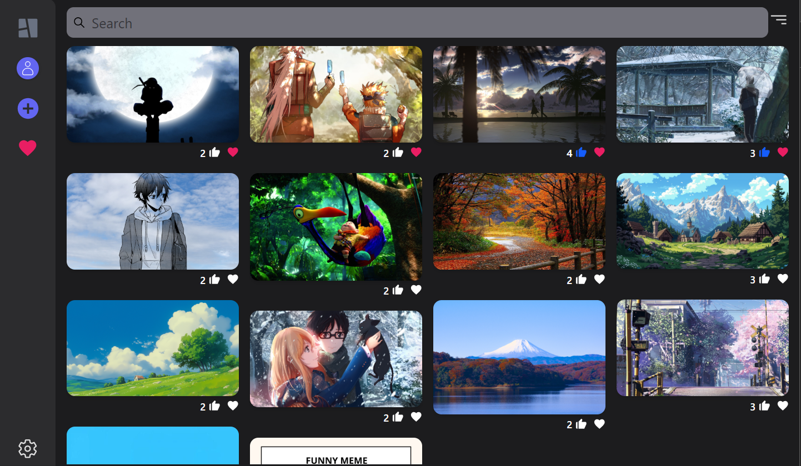
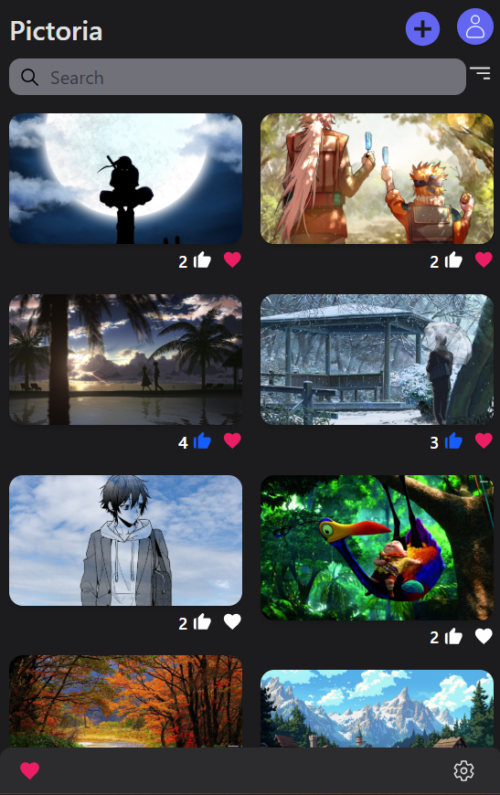

# Pictoria 🎨

Pictoria is a mordern image-sharing web app. Users can sign up, log in, and upload their favorite pictures. The app displays the images in a clean, responsive grid layout. I built this to practice React and get more comfortable with Firebase and Cloudinary.

---

### 🔗 Live Demo

👉 [https://pictoria-web.netlify.app]

---

## 🚀 Features

- User signup and login using Firebase Auth
- Upload images directly to Cloudinary
- Store image details (title, tags, URLs) in Firestore
- View all uploaded images on the homepage
- Advanvce UI and image grid layout
- Protected upload route (only logged-in users can upload)

---

## 🛠 Tech Stack

- **React** – Frontend framework
- **Firebase Auth** – User login/logout
- **Firestore** – Store image metadata
- **Cloudinary** – Image uploads and hosting
- **React Router** – Routing
- **Tailwind CSS** – Styling and Responsive design
- **Netlify** – Hosting

---

## 💡 Why I Built It

I wanted to build something more realistic than to-do lists and calculators — something visual and fun. This project helped me learn how to connect Firebase authentication with real-time image uploads, and how to work with external services like Cloudinary.

---

## 📸 Screenshots

### Homepage (Desktop)

### Homepage (Mobile)

---

## 🙋‍♂️ Contact

If you have feedback or just want to connect, feel free to reach out:

- **Name**: Lovey Singh Chauhan
- **LinkedIn**: [linkedin.com/in/loveychauhan01](https://www.linkedin.com/in/loveychauhan01)
- **Email**: loveychauhan68363@gmail.com
- **GitHub Repo**: [github.com/loveychauhan/pictoria](https://github.com/loveychauhan/pictoria)
